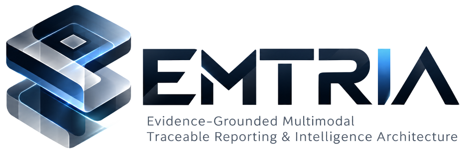
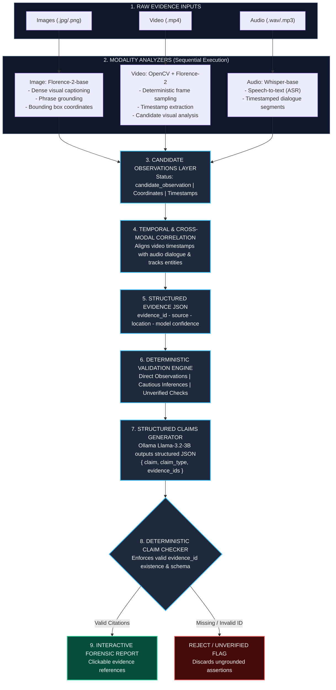

# EMTRIA — Evidence-Grounded Multimodal Traceable Reporting & Intelligence Architecture

<div align="center">



<br/>
<br/>

[](https://github.com/samuelmichaelalva/third_year_mini_project_emtria)
[](https://www.python.org/)
[](https://www.nvidia.com)
[](LICENSE)
[](#-hardware--budget)

**AI-assisted forensic decision-support system for preliminary crime-scene evidence analysis**

*Every claim in the generated report must be traceable to a specific evidence reference — no hallucinations, no guesswork.*

</div>

---

## What is EMTRIA?

**EMTRIA** (*Evidence-grounded Multimodal Traceable Reporting & Intelligence Architecture*) is a third-year IT mini-project that generates preliminary forensic crime-scene reports grounded entirely in uploaded evidence.

It processes three modalities simultaneously:

| Modality | Input | AI Model | Output |
|---|---|---|---|
| **Images** | Crime-scene photos, JPEG/PNG/WEBP | Florence-2-base | Bounding boxes + captions |
| **Video** | CCTV/surveillance footage, MP4/MKV/MOV | OpenCV + Florence-2 | Keyframe timestamps + visual events |
| **Audio** | Voice notes, emergency calls, WAV/MP3/FLAC | Whisper-base | Timestamped transcriptions |

### Core Mission
> Generate preliminary forensic reports where **every evidence-based finding is traceable** to an image bounding box, video timestamp/frame, or audio segment. No claim without a citation. No hallucination admitted.

*EMTRIA is a decision-support tool for preliminary triage. It does not replace forensic experts, establish guilt or innocence, or make final legal conclusions.*

---

## Web Interface (UI — Current State)

The EMTRIA forensic dashboard is a fully functional single-page application (SPA) built with vanilla HTML/CSS/JS — no frameworks, no cloud dependencies.

### Features Available Now

| Feature | Status |
|---|---|
| **Officer Authentication Modal** — premium two-panel design | Live |
| **1-Click Demo Login** (DET-4092 / emtria2026) | Live |
| **Officer Badge Pill** in navbar after login | Live |
| **Upload Gating** — authentication required to upload evidence | Live |
| **Navigation Lock** — Step 2 & 3 blocked until evidence is uploaded | Live |
| **Multi-file Evidence Upload** (Photos, Videos, Audio) with file chips | Live |
| **Light / Dark Mode** toggle | Live |
| **Forensic Canvas Background** (fingerprint + synapse animation) | Live |
| **3-Step SPA** (Upload → Process Pipeline → Forensic Report) | Live |
| **Report Print View** | Live |

### Authentication Modal

Users who click any upload action (dropzone, Add button, drag-and-drop, or Run AI Analysis) while unauthenticated are prompted with the Officer Access modal:

- **Left panel**: Dark navy brand panel with EMTRIA logo, compliance badges (ISO/IEC 27037, SHA-256 Signed, Chain-of-Custody)
- **Right panel**: 1-click Quick Demo access strip + manual Sign In / Register credential forms with clean icon inputs

---

## System Architecture



---

## Three Permanent Architectural Principles

### 1. No Evidence Reference — No Confirmed Finding
If a claim cannot be mapped to a specific `evidence_id` (bounding box, frame timestamp, or audio segment), it is **never** admitted as a factual observation in the report.

### 2. LLM Formats, Never Dictates Truth
The language model (Llama-3.2-3B via Ollama) is **strictly bound** to the validated structured evidence JSON. It writes sentences — it does not invent facts.

### 3. Observation vs. Inference vs. Unverified

| Category | Definition | Report Color |
|---|---|---|
| **Direct Observation** | Confirmed digital evidence with coordinates/timestamps | Green |
| **Cautious Inference** | Plausible context from observations — labeled uncertain | Purple |
| **Lab Mandated** | Requires chemical/physical/ballistic lab verification | Red |

---

## Hardware & Budget

| Spec | Value |
|---|---|
| **Target Device** | Acer Predator Helios Neo 16 |
| **GPU** | NVIDIA GeForce RTX 4050 Laptop GPU (6 GB VRAM) |
| **RAM** | 16 GB DDR5 |
| **OS** | Windows 11 |
| **Budget** | Rs. 0 — 100% local, free & open-source |

### VRAM Management Strategy

To prevent CUDA Out-of-Memory errors under 6 GB VRAM, EMTRIA uses a **Sequential Execution Pipeline**:

```
Load Florence-2  →  Process Visual Evidence  →  Unload & Free VRAM
Load Whisper-base  →  Transcribe Audio  →  Unload & Free VRAM
Invoke Ollama (keep_alive=0)  →  Synthesize Claims  →  Release Memory
```

---

## Tech Stack

| Layer | Technology |
|---|---|
| **UI** | HTML5, Vanilla CSS, Vanilla JS (SPA) |
| **Vision Model** | Microsoft Florence-2-base (local) |
| **Audio Model** | OpenAI Whisper-base (local) |
| **Language Model** | Meta Llama-3.2-3B via Ollama (local) |
| **Video Processing** | OpenCV |
| **Backend** | Python 3.10+ |
| **Auth Storage** | localStorage (client-side, chain-of-custody audit log) |

---

## Development Milestones

- [x] **Milestone 0** — Blueprint frozen (EMTRIA v2.1), README, architecture diagram
- [x] **Milestone 0.5** — Full forensic dashboard UI: officer auth modal, upload gating, navigation lock, 3-step SPA, light/dark mode, canvas animations, officer badge pill
- [ ] **Milestone 1** — Florence-2-base visual candidate observation engine + bounding-box extraction, verified on 10-30 crime-scene reference images
- [ ] **Milestone 2** — OpenCV frame sampler + Whisper-base transcription + temporal correlation layer
- [ ] **Milestone 3** — Python deterministic rules engine + Ollama structured claims generator + citation validator
- [ ] **Milestone 4** — Clickable report citations, full project documentation, defense PPT & evaluation report

---

## Running Locally

```bash
# Clone the repository
git clone https://github.com/samuelmichaelalva/third_year_mini_project_emtria.git
cd third_year_mini_project_emtria

# Serve the UI (Python built-in HTTP server)
python -m http.server 8080
```

Then open **http://localhost:8080** in your browser.

**Demo Credentials:**
```
Officer Badge ID:  DET-4092
Password:          emtria2026
```

Or click the **Quick Demo Access** button inside the auth modal for instant 1-click login.

---

## Academic Context

| Field | Detail |
|---|---|
| **Project Type** | Third-Year Information Technology Mini-Project |
| **Domain** | AI-Assisted Forensic Computing |
| **Architecture Version** | EMTRIA v2.1 (Blueprint Frozen) |
| **Compliance Standard** | ISO/IEC 27037 Digital Evidence Handling |

---

<div align="center">
<i>Built for academic purposes. EMTRIA does not constitute legal or forensic authority.</i>
</div>
